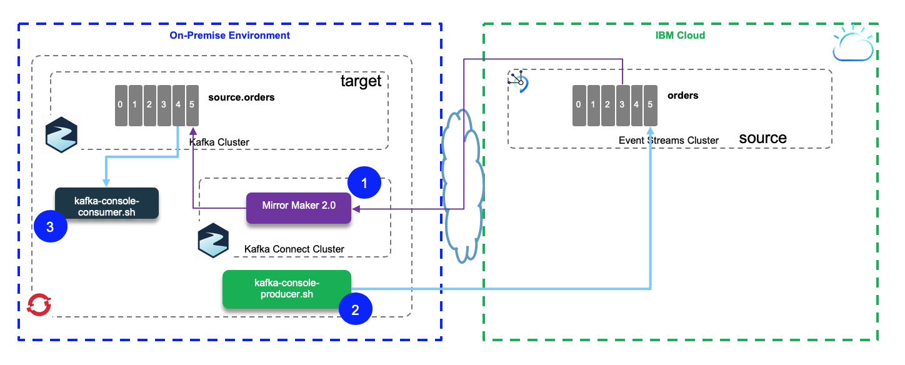

# To Event Streams to Kafka cluster on-premise

## Scenario 3: From Event Streams to local cluster

For this scenario the source is Event Streams on IBM Cloud and the target is a local server (may be on a laptop using vanilla Kafka image (Strimzi kafka 2.4 docker image) started with docker compose). This target cluster runs two zookeeper nodes, and three kafka nodes. We need 3 kafka brokers as mirror maker created topics with a replication factor set to 3.



This time the producer adds headers to the Records sent so we can validate headers replication. The file `es-cluster/es-mirror-maker.properties` declares the mirroring settings as below:

```properties
clusters=source, target
source.bootstrap.servers=broker-3-qnprtqnp7hnkssdz.kafka.svc01.us-east.eventstreams.cloud.ibm.com:9093,broker-1-qnprtqnp7hnkssdz.kafka.svc01.us-east.eventstreams.cloud.ibm.com:9093,broker-0-qnprtqnp7hnkssdz.kafka.svc01.us-east.eventstreams.cloud.ibm.com:9093,broker-5-qnprtqnp7hnkssdz.kafka.svc01.us-east.eventstreams.cloud.ibm.com:9093,broker-2-qnprtqnp7hnkssdz.kafka.svc01.us-east.eventstreams.cloud.ibm.com:9093,broker-4-qnprtqnp7hnkssdz.kafka.svc01.us-east.eventstreams.cloud.ibm.com:9093
source.security.protocol=SASL_SSL
source.ssl.protocol=TLSv1.2
source.sasl.mechanism=PLAIN
source.sasl.jaas.config=org.apache.kafka.common.security.plain.PlainLoginModule required username="token" password="985...";
target.bootstrap.servers=kafka1:9092,kafka2:9093,kafka3:9094
# enable and configure individual replication flows
source->target.enabled=true
source->target.topics=orders
```

* Start the target cluster runnning on your laptop using:

    ```shell
    docker-compose up
    ```

* Start [mirror maker2.0](https://cwiki.apache.org/confluence/display/KAFKA/KIP-382%3A+MirrorMaker+2.0): 

    By using a new container, start another kakfa 2.4+ docker container, connected to the  brokers via the `kafkanet` network, and mounting the configuration in the `/home`:

    ```shell
    docker run -ti --network kafkanet -v $(pwd):/home strimzi/kafka:latest-kafka-2.4.0 bash
    ```

    Inside this container starts mirror maker 2.0 using the script: `/opt/kakfa/bin/connect-mirror-maker.sh`

    ```shell
    /opt/kakfa/bin/connect-mirror-maker.sh /home/strimzi-mm2.properties
    ```

    The `strimzi-mm2.properties` properties file given as argument defines the source and target clusters and the topics to replicate:

    ```properties
    clusters=source, target
    source.bootstrap.servers=my-cluster-kafka-bootstrap-jb-kafka-strimzi.gse-eda-demos-fa9ee67c9ab6a7791435450358e564cc-0001.us-east.containers.appdomain.cloud:443
    source.security.protocol=SSL
    source.ssl.truststore.password=password
    source.ssl.truststore.location=/home/truststore.jks
    target.bootstrap.servers=kafka1:9092,kafka2:9093,kafka3:9094
    # enable and configure individual replication flows
    source->target.enabled=true
    source->target.topics=orders
    ```

    As the source cluster is deployed on Openshift, the exposed route to access the brokers is using TLS connection. So we need the certificate and create a truststore to be used by those Java programs. All kafka tools are done in java or scala so running in a JVM, which needs truststore for keep trusted TLS certificates. 
    When running from a remote system to get the certificate do the following steps:

    1. Get the host ip address from the Route resource

        ```shell
        oc get routes my-cluster-kafka-bootstrap -o=jsonpath='{.status.ingress[0].host}{"\n"}'
        ```

    1. Get the TLS certificate from the broker

        ```shell
        oc get secrets
        oc extract secret/my-cluster-cluster-ca-cert --keys=ca.crt --to=- > ca.crt
        ```

    1. Transform the certificate fo java truststore

        ```shell
        keytool -import -trustcacerts -alias root -file ca.crt -keystore truststore.jks -storepass password -noprompt
        ```

    For Openshift or Kubernetes deployment, the mirror maker descriptor needs to declare the TLS stamza:

    ```yaml
    mirrors:
    - sourceCluster: "my-cluster-source"
    targetCluster: "my-cluster-target"
    sourceConnector:
      config:
        replication.factor: 1
        offset-syncs.topic.replication.factor: 1
        sync.topic.acls.enabled: "false"
    targetConnector:
      tls:
        trustedCertificates:
          - secretName: my-cluster-cluster-cert
            certificate: ca.crt
    ```

* The consumer may be started in second or third step. To start it, you can use a new container or use one of the running kafka broker container. Using the `Docker perspective` in Visual Code, we can get into a bash shell within one of the Kafka broker container. The local folder is mounted to `/home`. Then the script, `consumeFromLocal.sh source.orders` will get messages from the replicated topic: `source.orders`

## Scenario 4: From Event Streams On Cloud to Strimzi Cluster on Openshift

We are reusing the Event Streams on Cloud cluster on Washington DC data center as source target and the vanilla Kafka 2.4 cluster as target, also running within Washington data center in a OpenShift Cluster. As both clusters are in the same data center, we deploy Mirror Maker 2.0 close to target kafka cluster.


