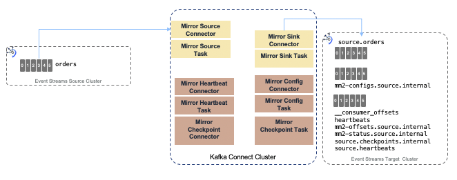

# Introduction

This repository includes a set of documents for best practices around data replication between two Kafka clusters.

## Requirements

### Mirror Maker 2.0

Mirror Maker 2.0 is the new replication feature of Kafka 2.4. It was defined as part of the [KIP 382](https://cwiki.apache.org/confluence/display/KAFKA/KIP-382%3A+MirrorMaker+2.0).

#### General concepts

As [Mirror maker 2.0](https://strimzi.io/docs/master/#con-configuring-mirror-maker-deployment-configuration-kafka-mirror-maker) is using kafka Connect framework, we recommend to review our summary [in this note](https://ibm-cloud-architecture.github.io/refarch-eda/kafka/connect/).

The figure below illustrates the mirror maker internal components running within Kafka Connect.



In distributed mode, Mirror Maker creates the following topics to the target cluster:

* mm2-configs.source.internal: This topic will store the connector and task configurations.
* mm2-offsets.source.internal: This topic is used to store offsets for Kafka Connect.
* mm2-status.source.internal: This topic will store status updates of connectors and tasks.
* source.heartbeats
* source.checkpoints.internal

A typical mirror maker configuration is done via property file and defines source and target clusters with their connection properties and the replication flow definitions. Here is a simple example for a local cluster to a target cluster using TLS v1.2 for connection encryption and Sasl authentication protocol to connect to Event Streams.

```properties
clusters=source, target
source.bootstrap.servers=${KAFKA_SOURCE_BROKERS}
target.bootstrap.servers=${KAFKA_TARGET_BROKERS}
target.security.protocol=SASL_SSL
target.ssl.protocol=TLSv1.2
target.ssl.endpoint.identification.algorithm=https
target.sasl.mechanism=PLAIN
target.sasl.jaas.config=org.apache.kafka.common.security.plain.PlainLoginModule required username="token" password=${KAFKA_TARGET_APIKEY};
# enable and configure individual replication flows
source->target.enabled=true
source->target.topics=products
tasks.max=10
```

* White listed topics are set with the `source->target.topics` attribute of the replication flow and uses [Java regular expression](https://www.vogella.com/tutorials/JavaRegularExpressions/article.html) syntax.
* Blacklisted topics: by default the following pattern is applied:

```properties
blacklist = [follower\.replication\.throttled\.replicas, leader\.replication\.throttled\.replicas, message\.timestamp\.difference\.max\.ms, message\.timestamp\.type, unclean\.leader\.election\.enable, min\.insync\.replicas]
```

but can be also specified with the properties: `topics.blacklist`. Comma-separated lists are also supported and Java regular expression.

Internally `MirrorSourceConnector` and `MirrorCheckpointConnector` will create multiple tasks (up to `tasks.max` property), `MirrorHeartbeatConnector`
creates only one single task. `MirrorSourceConnector` will have one task per topic-partition to replicate, while `MirrorCheckpointConnector` will have one task per consumer group. The Kafka connect framework uses the coordinator API, with the `assign()` API, so there is no consumer group while fetching data from source topic. There is no call to `commit()` neither: the rebalancing occurs only when there is a new topic created that matches the whitelist pattern.

#### Local cluster to Event Streams on Cloud

The goal is to replicate data from local Kafka cluster to Event Streams on IBM Cloud as managed service. The two scenarios are presented in [this note](local-to-es.md).

#### Provisioning Connectors (Mirror Maker 2)

* How to handle secrets (ES credentials, CK keys and certificates).
* GUI tools 
* Command line / REST API

#### Version to version migration

How to address Roll out upgrades to MM2 cluster

### Security

* Topic segregation (multi-tenant Kafka Connect cluster)
* ACLs

### Monitoring

* Prometheus metrics (On same setup as CK monitoring)
* Dashboards
* Alerts
* Log formats, and logs going into Splunk

### Best Practices

* Correct configuration
* How to address scenarios with duplicates (no Exactly Once)?
* How many MM connectors per cluster?
* How many nodes per cluster?
* How do we scale the MM2 cluster?
* Other best practices

### Performance  tests

* How to measure latency (avg. time per message end-to-end)
* Ensure message affinity
* Message loss
* Duplicates (No Exactly Once)