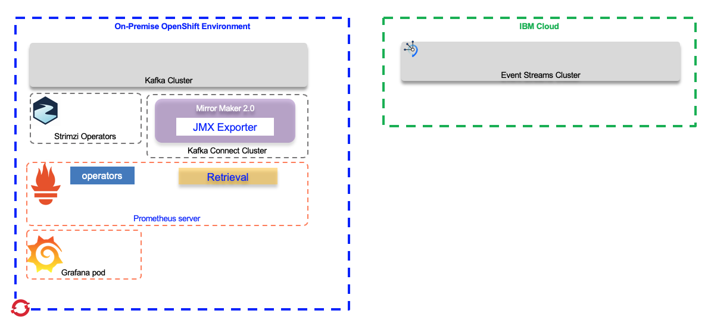

# Monitoring Mirror Maker and kafka connect cluster

The goal of this note is to go over some of the details on how to monitor Mirror Maker 2.0 metrics to Prometheus and how to use Grafana dashboard.

[Prometheus](https://prometheus.io/docs/introduction/overview/) is an open source systems monitoring and alerting toolkit that, with Kubernetes, is part of the Cloud Native Computing Foundation. It can monitor multiple workloads but is normally used with container workloads. 

Here is simple diagram to explain prometheus generic architecture from their main website:


In the context of data replication between kafka cluster, what we want to monitor the mirror maker 2.0 metrics:



In order to run the example Grafana dashboards to monitor MM2, you must:

1. Add metrics configuration to your Kafka cluster resources (Mirror Maker 2.0)
2. Deploy Prometheus and optionally Prometheus Alertmanager
3. Deploy Grafana

For the interest of monitoring we can add Kafka Exporter to assess the consumer lag.

## Installation and configuration

Prometheus deployment inside Kubernetes uses operator as defined in [the coreos github](https://github.com/coreos/prometheus-operator). The CRDs define a set of resources. The ServiceMonitor, PodMonitor, PrometheusRule are used.

Inside the [Strimzi github repository](https://github.com/strimzi/strimzi-kafka-operator), we can get a [prometheus.yml](https://github.com/strimzi/strimzi-kafka-operator/blob/master/examples/metrics/prometheus-install/prometheus.yaml) file to deploy prometheus server. This configuration defines, ClusterRole, ServiceAccount, ClusterRoleBinding, and the Prometheus resource instance. 
*For your own deployment you have to change the target namespace, and the rules*

You need to deploy Prometheus and all the other elements inside the same namespace or OpenShift project as the Kafka Cluster or the KafkaConnect Cluster.

To be able to monitor your own Kafka cluster you need to enable Prometheus metrics. An example of Kafka cluster Strimzi based deployment can be found [here](https://github.com/strimzi/strimzi-kafka-operator/blob/master/examples/metrics/kafka-metrics.yaml)


### Install Prometheus

* After creating a namespace or reusing the Kafka cluster namespace, you need to deploy the Prometheus operator by first downloading the different configuration yaml files:

    ```shell
    curl -s https://raw.githubusercontent.com/coreos/prometheus-operator/master/example/rbac/prometheus-operator/prometheus-operator-deployment.yaml | sed -e "s/namespace: default/namespace: jb-kafka-strimzi/" > prometheus-operator-deployment.yaml
    ```

    ```shell
    curl -s https://raw.githubusercontent.com/coreos/prometheus-operator/master/example/rbac/prometheus-operator/prometheus-operator-cluster-role.yaml > prometheus-operator-cluster-role.yaml
    ```

    ```shell
    curl -s https://raw.githubusercontent.com/coreos/prometheus-operator/master/example/rbac/prometheus-operator/prometheus-operator-cluster-role-binding.yaml | sed -e "s/namespace: default/namespace: jb-kafka-strimzi/" > prometheus-operator-cluster-role-binding.yaml
    ```

    ```shell
    curl -s https://raw.githubusercontent.com/coreos/prometheus-operator/master/example/rbac/prometheus-operator/prometheus-operator-service-account.yaml | sed -e "s/namespace: default/namespace: jb-kafka-strimzi/" > prometheus-operator-service-account.yaml
    ```

!!! Note
        The prometheus-operator-deployment.yaml define security context the operator pod will use. It is set as a non root user (unprivileged). If you need to change that, or reference an existing user modify the file.  

* Deploy the operator, cluster role, binding and service account (see files under `monitoring` folder):

    ```shell
    oc apply -f prometheus-operator-deployment.yaml
    oc apply -f prometheus-operator-cluster-role.yaml
    oc apply -f prometheus-operator-cluster-role-binding.yaml
    oc apply -f prometheus-operator-service-account.yaml
    ```

When you apply those configuration, the following resources are managed by the Prometheus Operator:

| Resource | Description | 
| --- | --- | 
|ClusterRole | To grant permissions to Prometheus to read the health endpoints exposed by the Kafka and ZooKeeper pods, cAdvisor and the kubelet for container metrics.|
| ServiceAccount | For the Prometheus pods to run under. |
| ClusterRoleBinding | To bind the ClusterRole to the ServiceAccount.|
| Deployment | To manage the Prometheus Operator pod. |
| ServiceMonitor | To manage the configuration of the Prometheus pod.|
| Prometheus | To manage the configuration of the Prometheus pod. |
| PrometheusRule | To manage alerting rules for the Prometheus pod. |
|  Secret | To manage additional Prometheus settings. |
| Service  | To allow applications running in the cluster to connect to Prometheus (for example, Grafana using Prometheus as datasource) |

### Deploy prometheus

!!! Note
        The following section is including the configuration of a Prometheus server monitoring a full Kafka Cluster. For Mirror Maker or Kafka Connect only the configuration will have less rules, and configuration. See [next section](#mirror-maker-monitoring).


Deploy the prometheus server by first changing the namespace and also by adapting [the original file](https://github.com/strimzi/strimzi-kafka-operator/blob/master/examples/metrics/prometheus-install/prometheus.yaml).

```shell
curl -s  https://raw.githubusercontent.com/strimzi/strimzi-kafka-operator/master/examples/metrics/prometheus-install/prometheus.yaml | sed -e "s/namespace: myproject/namespace: jb-kafka-strimzi/" > prometheus.yml
```

If you are using AlertManager (see [section below](#alert-manager)) Define the monitoring rules of the kafka run time: KafkaRunningOutOfSpace, UnderReplicatedPartitions, AbnormalControllerState, OfflinePartitions, UnderMinIsrPartitionCount, OfflineLogDirectoryCount, ScrapeProblem (Prometheus related alert), ClusterOperatorContainerDown, KafkaBrokerContainersDown, KafkaTlsSidecarContainersDown

```shell
curl -s 
https://raw.githubusercontent.com/strimzi/strimzi-kafka-operator/master/examples/metrics/prometheus-install/prometheus-rules.yaml sed -e "s/namespace: default/namespace: jb-kafka-strimzi/" > prometheus-rules.yaml
```

```shell
oc apply -f prometheus-rules.yaml
oc apply -f prometheus.yaml
```

The Prometheus server configuration uses service discovery to discover the pods in the cluster from which it gets metrics.

### Install Grafana

[Grafana](https://grafana.com/) provides visualizations of Prometheus metrics. Again we will use the Strimzi dashboard definition as starting point to monitor Kafka cluster but also mirror maker.

* Deploy Grafan to OpenShift and expose it via a service:

```shell
oc apply -f grafana.yaml
```

In case you want to test grafana locally run: `docker run -d -p 3000:3000 grafana/grafana`

## Kafka Explorer


## Mirror maker monitoring

## Configure Grafana dashboard

To access the Grafana portal you can use port forwarding like below or expose a route on top of the grafana service.

* Use port forwarding:

```shell
export PODNAME=$(oc get pods -l name=grafana | grep grafana | awk '{print $1}')
kubectl port-forward $PODNAME 3000:3000
```

Point your browser to http://localhost:3000.

* Expose the route via cli

Add the Prometheus data source with the URL of the exposed routes. http://prometheus-operated:9090

## Alert Manager

As seen in previous section, when deploying prometheus we can set some alerting rules on elements of the Kafka cluster. Those rule examples are in the file `The prometheus-rules.yaml`. Those rules are used by the AlertManager component.

[Prometheus Alertmanager](https://prometheus.io/docs/alerting/alertmanager/) is a plugin for handling alerts and routing them to a notification service, like Slack. The Prometheus server is a client to the Alert Manager.

* Download an example of alert manager configuration file

```shell
curl -s https://raw.githubusercontent.com/strimzi/strimzi-kafka-operator/master/examples/metrics/prometheus-install/alert-manager.yaml > alert-manager.yaml
```

* Define a configuration for the channel to use, by starting from the following template

```shell
curl -s https://raw.githubusercontent.com/strimzi/strimzi-kafka-operator/master/examples/metrics/prometheus-alertmanager-config/alert-manager-config.yaml > alert-manager-config.yaml
```

* Modify this file to reflect the remote access credential and URL to the channel server. 

* Then deploy the secret that matches your config file .

```shell
oc create secret generic alertmanager-alertmanager --from-file=alertmanager.yaml=alert-manager-config.yaml
```


```shell
oc create secret generic additional-scrape-configs --from-file=./local-cluster/prometheus-additional.yaml --dry-run -o yaml | kubectl apply -f -
```