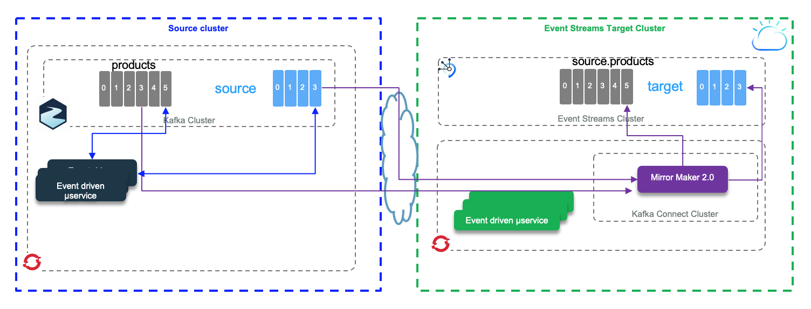

# Running a custom Mirror Maker 2.0

In this approach we are using properties file to define the Mirror Maker 2.0 configuration, package JMX exporter with it inside a docker image and deploy the image to Openshift.
The configuration approach supports the replication from local on-premise cluster running on kubernetes cluster to Event Streams on cloud.



## Define the MM configuration

The configuration define the source and target cluster and the security settings for both clusters. As the goal is to run within the same OpenShift cluster as Kafka, the broker list for the source matches the URL within the broker service:

```shell
# get the service URL
oc describe svc my-cluster-kafka-bootstrap
# URL my-cluster-kafka-bootstrap:9092
```
The target cluster uses the bootstrap servers from the Event Streams Credentials, and the API KEY is defined with the manager role, so mirror maker can create topic dynamically.

Properties file can be seen [here]()

```
clusters=source, target
source.bootstrap.servers=my-cluster-kafka-bootstrap:9092
source.ssl.endpoint.identification.algorithm=
target.bootstrap.servers=broker-3-h6s2xk6b2t77g4p1.kafka.svc01.us-east.eventstreams.cloud.ibm.com:9093,broker-1-h6s2xk6b2t77g4p1.kafka.svc01.us-east.eventstreams.cloud.ibm.com:9093,broker-0-h6s2xk6b2t77g4p1.kafka.svc01.us-east.eventstreams.cloud.ibm.com:9093,broker-5-h6s2xk6b2t77g4p1.kafka.svc01.us-east.eventstreams.cloud.ibm.com:9093,broker-2-h6s2xk6b2t77g4p1.kafka.svc01.us-east.eventstreams.cloud.ibm.com:9093,broker-4-h6s2xk6b2t77g4p1.kafka.svc01.us-east.eventstreams.cloud.ibm.com:9093
target.security.protocol=SASL_SSL
target.ssl.protocol=TLSv1.2
target.ssl.endpoint.identification.algorithm=https
target.sasl.mechanism=PLAIN
target.sasl.jaas.config=org.apache.kafka.common.security.plain.PlainLoginModule required username="token" password="<Manager API KEY from Event Streams>";
# enable and configure individual replication flows
source->target.enabled=true
sync.topic.acls.enabled=false
replication.factor=3
internal.topic.replication.factor=3
refresh.topics.interval.seconds=10
refresh.groups.interval.seconds=10
source->target.topics=products
tasks.max=10
```

Upload the properties as a secret

```shell
oc create secret generic mm2-std-properties --from-file=kafka-to-es.properties
```

## Defining a custom docker image

Starting from the Kafka 2.4 image, we need to add Prometheus JMX exporter. The docker file is [here].

```Dockerfile
```

```shell
docker build -t ibmcase/mm2ocp:v0.0.2 .
docker push ibmcase/mm2ocp:v0.0.2
```

## Deploy the application

```shell
oc new-app --docker-image ibmcase/mm2ocp:v0.0.2
```

To undeploy everything

```shell
oc delete all -l app=mm2ocp
```

oc create secret generic additional-scrape-configs --from-file=./local-cluster/prometheus-additional.yaml --dry-run -o yaml | kubectl apply -f -